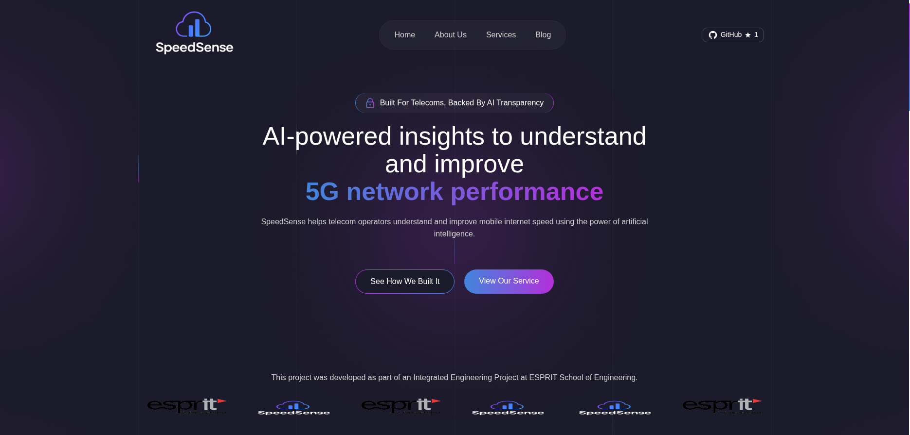
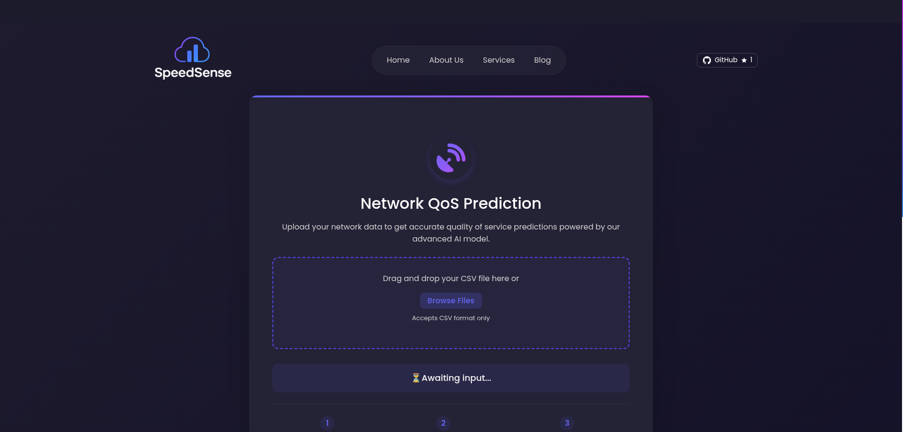
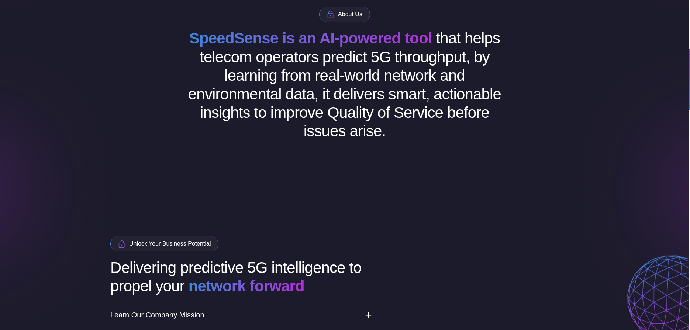

# SpeedSense 🌐

This repository contains the source code for the **SpeedSense** webpage — a public-facing interface for our AI-powered 5G network throughput prediction tool.  
🌍 **Live site:** [speedsense.me](https://speedsense.me)  
🤖 **Main AI Project:** [QosMLOPS GitHub Repo](https://github.com/RideneFiras/QosMLOPS)

## 🔎 What is SpeedSense?

SpeedSense is a user-friendly web interface that connects to our backend machine learning models, allowing telecom engineers and enthusiasts to:
- Upload network parameters
- Predict throughput speeds
- Visualize results and SHAP-based insights
- Access optimization tips

The goal is to make AI-powered network intelligence accessible and actionable.

## 🖼️ Screenshots

Below are example screenshots of the application, located in the `assets/` folder:
- 
- 
- 

## 📁 Folder Structure (Main Parts)

```
.
├── frontend/        # HTML files and assets
├── Models/          # ML models or APIs 
├── services/        # Backend service logic
├── app.py           # Main FastAPI app
├── Dockerfile       # Container setup
├── Makefile         # Development utilities
├── requirements.txt # Python dependencies
└── assets/          # Screenshots and static images
```

## 🧪 Setup 

Only needed if you're running locally:

```
git clone https://github.com/RideneFiras/SpeedSense_Front.git
cd ThisRepo
python -m venv venv
source venv/bin/activate
pip install -r requirements.txt
uvicorn app:app --reload
```

## 📬 Contact

For feedback or suggestions, feel free to reach out via contact@speedsense.me
