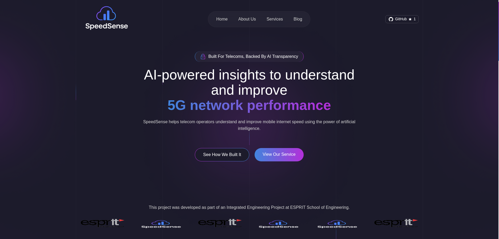

# SpeedSense 🌐

SpeedSense is the lightweight, public-facing frontend for our AI-powered 5G throughput prediction system — designed for telecom operators and researchers.  
This interface connects to our full backend stack to deliver real-time predictions, explainable insights, and PDF exports.  
🌍 **Live site:** [speedsense.me](https://speedsense.me)  
🤖 **Full ML/MLOps Project:** [QosMLOPS GitHub Repo](https://github.com/RideneFiras/QosMLOPS)

---

This work was developed as part of the **Integrated Project** at [Esprit School of Engineering](https://esprit.tn/), under the guidance of professors **Rahma Bouraoui**, **Safa Cherif**, and **Zaineb Labidi**.


---
## 🖼️ Preview

  
More in the [`assets/`](assets/) folder.

---

## ✨ What You Can Do with SpeedSense

- 📥 Upload network performance data in CSV format  
- 📈 Get **real-time 5G throughput predictions** powered by XGBoost  
- 🧠 Understand model behavior with **SHAP explainability**  
- 💬 Generate **GPT-4o-powered QoS summaries** for every prediction  
- 📄 **Export results as PDF**  
- 🖐️ Or use our **manual input form** (for users without a CSV file)

---

## 🤖 Chatbot (LLM FAQ Assistant)

SpeedSense includes a smart FAQ chatbot trained on 30+ domain-specific questions.  
Built using Gemini + vector search (RAG)

This chatbot is embedded in the **About Us** page.

---

## 🧠 AI Insight System

Each prediction includes:
- SHAP values showing feature impact
- GPT-4o-generated insights:
  - QoS Rating
  - Key influencing features
  - Optimization tips
- Displayed directly in-browser
- Exportable as PDF

---

## 📁 Folder Structure

```
.
├── app.py                    # Main FastAPI app
├── Dockerfile                # Docker container setup
├── Makefile                  # CLI commands (build, run, etc.)
├── README.md                 # Project overview
├── requirements.txt          # Python dependencies
├── .env                      # Local environment variables
├── .gitignore
│
├── assets/                   # Images and demo screenshots
│   └── ... (e.g. screen1.png, gif.gif)
│
├── Models/                   # Trained ML model files (e.g. best_xgb_model.pkl)
│
├── services/                 # All backend logic
│   ├── __init__.py
│   ├── chatgpt_service.py        # GPT-powered explanation generator
│   ├── embedding_utils.py        # Gemini embeddings wrapper
│   ├── faq_data.py               # FAQ base content (optional after caching)
│   ├── faq_index.pkl             # Precomputed FAQ vector index
│   ├── faq_search.py             # RAG search logic (cosine similarity)
│   ├── generate_faq_index.py     # Script to create faq_index.pkl
│   └── preprocessing.py          # Data transformation for prediction
│
├── frontend/                # Public site UI
│   ├── aboutus.html              # Main About Us page
│   ├── csv.html                  # CSV upload input page
│   ├── explain.html              # SHAP explanation page
│   ├── index.html                # Homepage
│   ├── predict.html              # Manual input form
│   │
│   ├── components/               # Reusable page components
│   │   └── chatbot.html              # LLM FAQ assistant (auto-included in About Us)
│   │
│   ├── css/                      # Stylesheets (global + chatbot-specific)
│   ├── js/                       # JavaScript logic (if decoupled from HTML)
│   ├── images/                   # Icons, logos, illustrations
│   └── webfonts/                 # Font files
```

---

## ⚙️ Local Setup

```bash
git clone https://github.com/RideneFiras/SpeedSense_Front.git
cd SpeedSense_Front
python -m venv venv
source venv/bin/activate
pip install -r requirements.txt
uvicorn app:app --reload
```

Then open [http://127.0.0.1:8000](http://127.0.0.1:8000)

---

## 📬 Contact

For feedback or support: **contact@speedsense.me**
